# AZMOVIES
Final project of Web Advanced module and Base project II for movie website of Semester III at VKU.

## 📍 Features
- Register, login, change infomations
- Watch movie, search, filter movies
- Love, save, comment movie
- Manage movie (admin)
- **API details:**
    - `/movies` - GET
    - `/movies/:slug` - GET
    - `/movies` - POST
    - `/movies/:slug` - PUT
    - `/movies/:slug` - DELETE
    - `/users` - GET
    - `/users/:email` - GET
    - `/users` - POST
    - `/users/:email` - PUT
    - `/love_movies` - POST
    - `/love_movies/:user_email/:slug_movie` - DELETE
    - `/saved_movies` - POST
    - `/saved_movies/:user_email/:slug_movie` - DELETE
    - `/comments` - POST
    - `/comments/:user_email/:slug_movie/:content` - DELETE

## 📃Example
<p>
  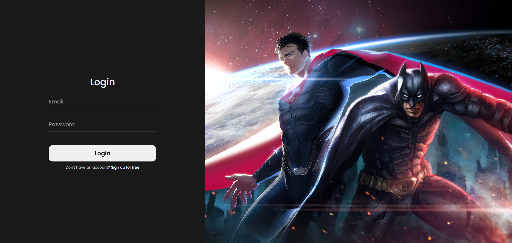
  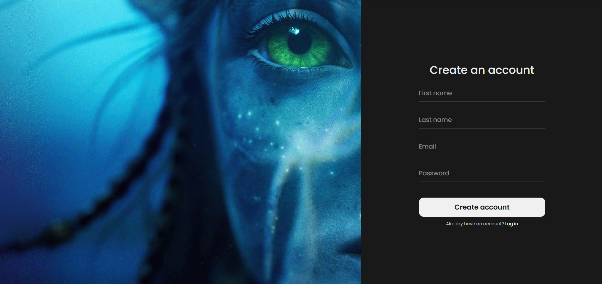
</p>
<p>
  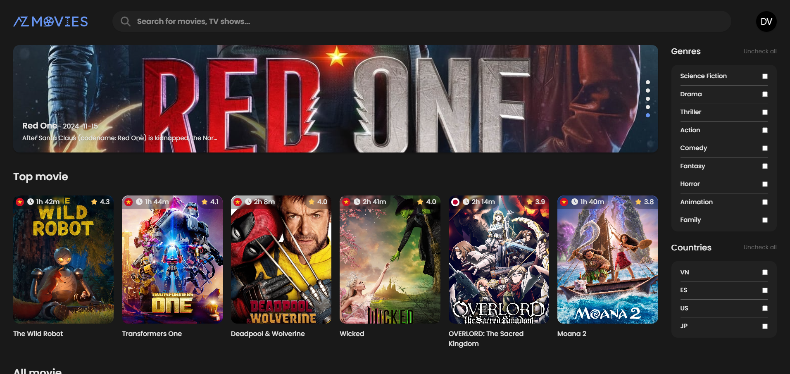
  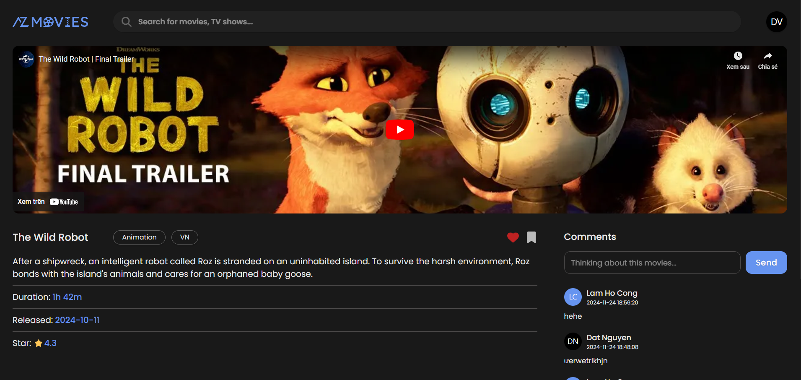
</p>
<p>
  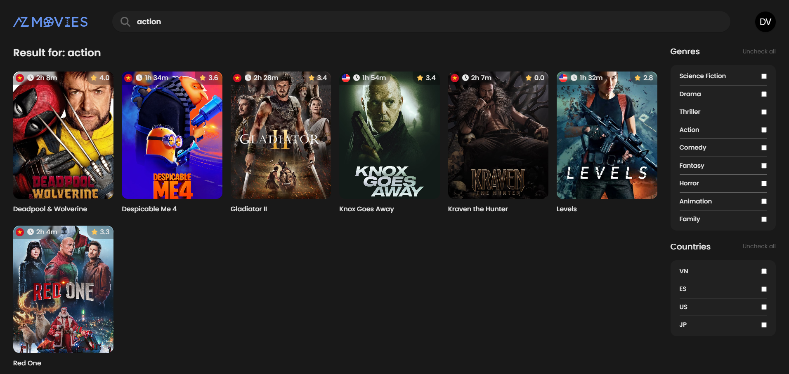
  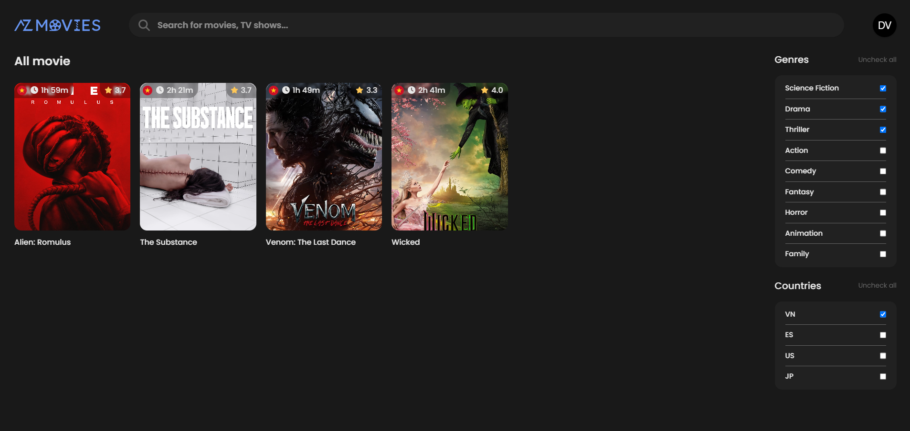
</p>
</p>
<p>
  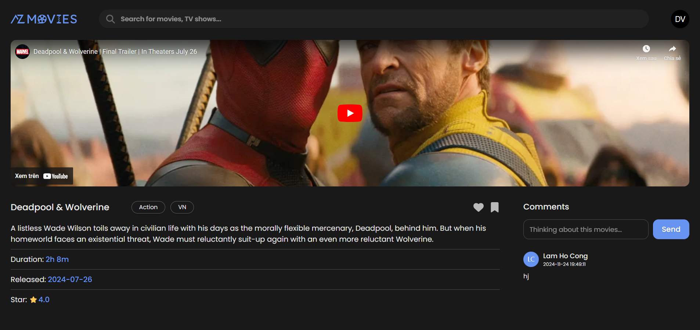
  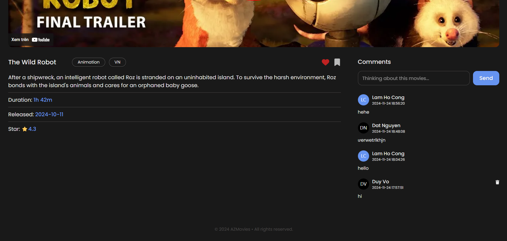
</p>
</p>
<p>
  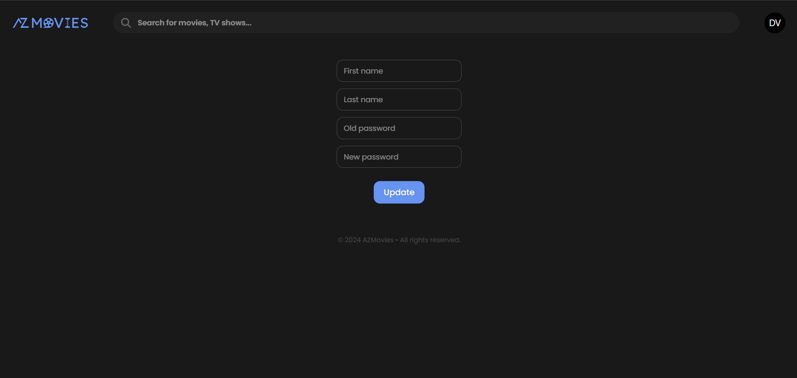
  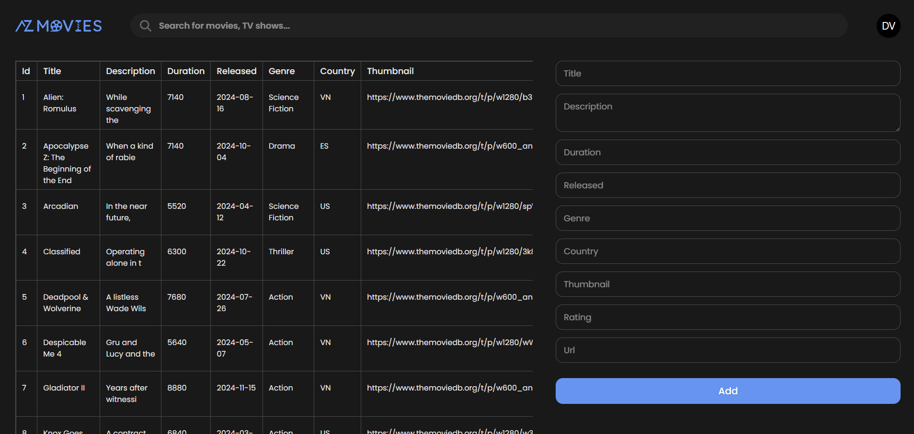
</p>

## 🛠️ Built with
- Frontend: Javascript (ReactJS)
- Backend: PHP (Restful API Laravel)

## ⚙️ Installation
### 1. Clone repository
```bash
git clone https://github.com/zoohuyvn/azmovies.git
```
### 2. Install environment
- Composer: [Composer 2.8.3](https://getcomposer.org/Composer-Setup.exe)
- XAMPP: XAMPP 8.0.30
    - [Windows](https://sourceforge.net/projects/xampp/files/XAMPP%20Windows/8.0.30/xampp-windows-x64-8.0.30-0-VS16-installer.exe)
    - [Linux](https://sourceforge.net/projects/xampp/files/XAMPP%20Linux/8.0.30/xampp-linux-x64-8.0.30-0-installer.run)
    - [macOS](https://sourceforge.net/projects/xampp/files/XAMPP%20Mac%20OS%20X/8.0.28/xampp-osx-8.0.28-0-installer.dmg)
### 3. Import SQL
Step 1: Run XAMPP Control Panel and click start Apache and MySQL<br>
Step 2: Go to [phpMyAdmin](http://localhost/phpmyadmin)<br>
Step 3: Create new database name `azmovies`<br>
Step 4: Import [SQL file](./azmovies.sql) into database
### 4. Open in IDE
You can open the project with an IDE like IntelliJ IDEA, Visual Studio Code, etc. Here I use [VS Code (v1.95)](https://code.visualstudio.com/sha/download?build=stable&os=win32-x64-user).<br>
Open VS Code, click `File/Open Folder` and browse to directory you cloned.

## 👉 Usage
Access to project folder, then open terminal in folder `frontend` and run this command:<br>
```bash
npm i
npm start
```
Then open second terminal in folder `backend` and run this command to start API:<br>
```bash
php artisan serve
```
Website will run on default url:
- [`http://localhost:3000`](http://localhost:3000) (Frontend)
- [`http://localhost:8000`](http://localhost:8000) (Backend - API)

## ✒️ Diagrams
<p>
  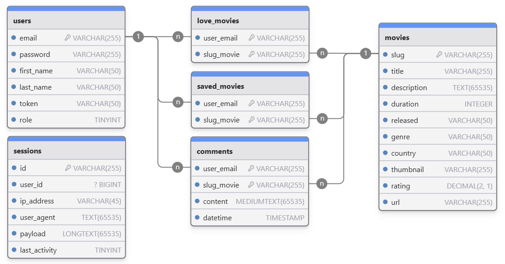
</p>
<p>
  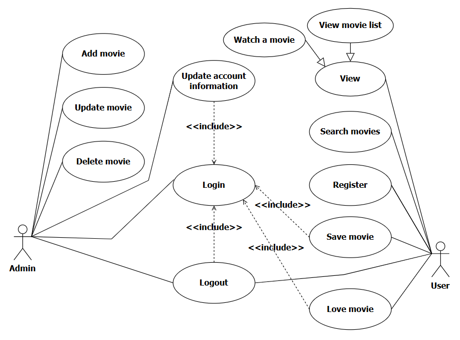
  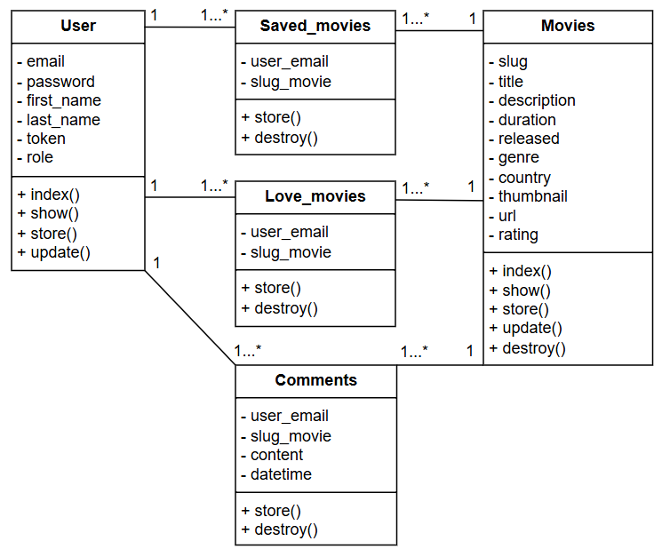
</p>

## 🫂 Contributing
If you'd like to contribute, fork the repository and use a feature branch.

## 📄 License

## 🥹 Acknowledgments
I'm look forward to receiving feedback as I develop further. Thanks for viewing my project ✨.

## ✨ Support
Give a ⭐ if this project helped you!<br><br>
<a href='https://www.buymeacoffee.com/zoohuyvn' target='_blank'></a>
